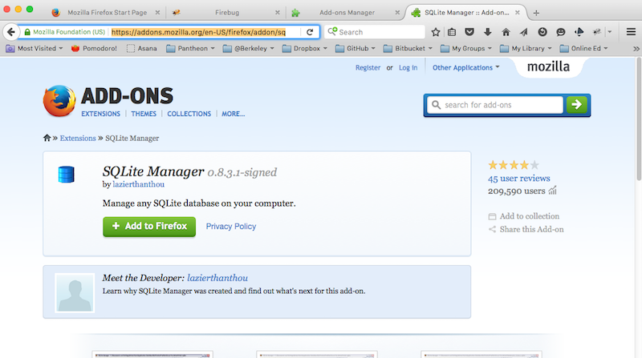
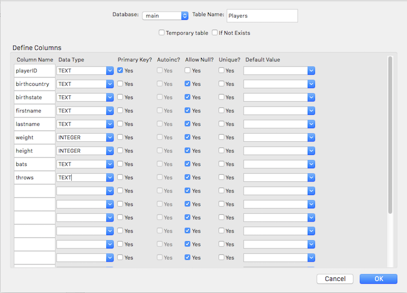

#SQL Workshop Part 1
##Outcomes
* Create a simple sql database using the Firefox SQLite Manager
* Use the INSERT and SELECT commands to modify and query the database
* Discuss data normalization, including 1NF, 2NF, and 3NF
##Getting started
I this workshop we'll use SQLite, a powerful and easy to install database engine. Conveniently, it's built in to the Firefox web browser. If you don't have Firefox installed, please install it now. Once it's installed, you'll need to also install the [SQLite Manager extension](https://addons.mozilla.org/en-US/firefox/addon/sqlite-manager/).



Once you've installed SQLite Manager, you can start it from the Firefox tools menu.


## Create a database and a table
* Start the SQLite Manager
* Choose "New Database" from the Database menu
* Name the new database "Baseball" and save it in a project directory.
* Choose "Create Table" from the Table menu.
* Fill in the form like this:



* Click OK, and note the code that pops up in the confirmation box. It contains a SQL command for creating a new table in a database. We could also have created this table by typing this command into the "Enter SQL" box and running it. Note the required semi-colon at the end of the command

###Challenge
Write a SQL command to create a table called FavoritePlayer containing fields called Fan_name and PlayerID.

## Add data
* Type or cut and paste the following line into the command box:
```sql
INSERT INTO Players (playerID, birthcountry, birthstate, firstname, lastname, weight, height, bats, throws)
VALUES('poseybu01','USA','GA','Buster','Posey',220,73,'R','R');
```
* All text data must be enclosed in single quotes.
* The list of field names is not required, but if omitted the values must be in the same order as in the original CREATE TABLE statement.
* The list of fields and values does not have to be complete, but an error will occur if values are omitted for a field that does not allow NULL values and does not have a default value defined.
* Let's add come more data:
```sql
INSERT INTO "Players" VALUES('pencehu01','USA','TX','Hunter','Pence',220,76,'R','R');
INSERT INTO "Players" VALUES('linceti01','USA','WA','Tim','Lincecum',170,71,'L','R');
INSERT INTO "Players" VALUES('sandopa01','Venezuela','Ca','Pablo','Sandoval',240,71,'B','R');
INSERT INTO "Players" VALUES('bumgama01','USA','NC','Madison','Bumgarner',235,77,'R','L');
INSERT INTO "Players" VALUES('crawfbr01','USA','CA','Brandon','Crawford',215,74,'L','R');
INSERT INTO "Players" VALUES('romose01','USA','CA','Sergio','Romo',185,70,'R','R');
```

## Queries
* Data queries require at least two component, SELECT and FROM
* For example, all the data in Players can be retrieved like this:
```sql
SELECT * 
FROM Players;
```
* SELECT can contain specific field names.

```sql
SELECT playerID, firstname, lastname
FROM Players;
```
* Results can be ordered

```sql
SELECT playerID, firstname, lastname
FROM Players
ORDER By lastname ASC;
```

* Results can be formatted. Here's and example of concatenating the first and last name, and changing the label.

```sql
SELECT playerID, firstname || lastname as name
FROM Players
ORDER By lastname ASC;
```
### Challenge
Can you figure out how to add a space between the the first and last names?

* It's possible to calculate aggregate statistics like averages from our table -- some other aggregate functions are max(), min(), count(), and sum()

```sql
SELECT avg(weight) as avgweight
FROM Players;
```

* The DISTINCT clause is used when you need a set of the unique members of a field or combination of fields.

```sql
SELECT DISTINCT birthcountry
FROM Players;
```
* To filter results, a WHERE clause is used. to list all players that bat lefthanded we can do this:

```sql
SELECT firstname || lastname as lefties
FROM Players
WHERE bats='L';
```
* And it's possible to add multiple WHERE conditions using AND and OR
```sql
SELECT firstname || lastname as lefties
FROM Players
WHERE bats='L' OR bats='B';
```

###Challenge
To do a "not equals" comparison, use <> or !=. Try and write a query to list all players who bat and throw differently. 

In Part 2, we'll look at more variations of the WHERE clause as well as SELECT statements that join multiple tables and perform group operations on results.

## Data modelling
So far, all our examples have used only a single table, but the power of a relational model for data storage becomes more apparent when there are multiple tables involved. In Part 2 of this workshop (next Monday), I'll teach you how to query multiple tables. For the rest of this class, we're going to discuss some basic principles of normalization and entity modelling. 

In our current database, we have some limited player information: name, birthplace, height, weight, and "handedness". Let's think about what happens if we add notions of teams, time, and salaries. We'll begin by listing all the elements and dimensions and then we'll create table diagrams and lines that show the links between tables. I haven't included these diagrams to this document yet, because I think it's important to work through the derivation process. In the process, we'll discuss what's meant by normal forms and keys and other types of entity relationships. 